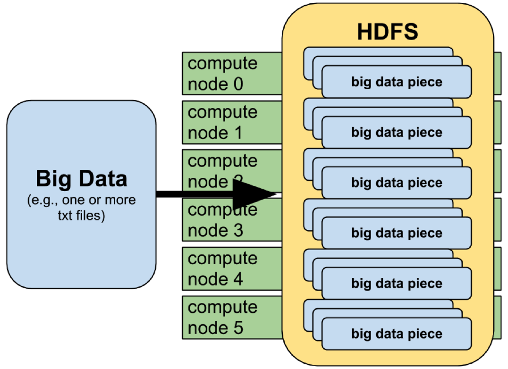
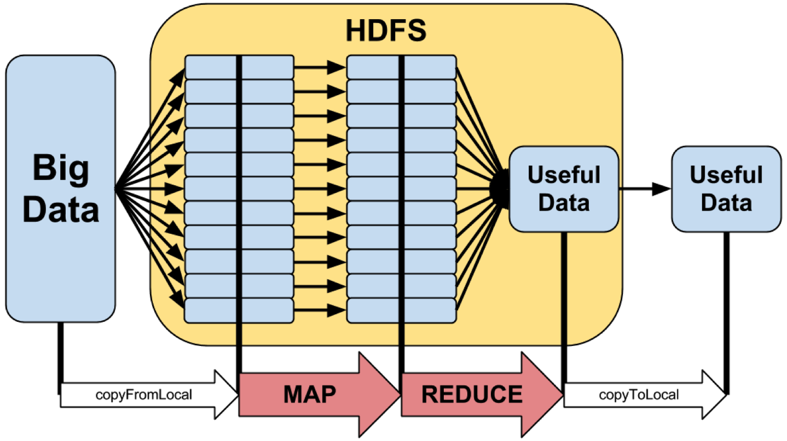
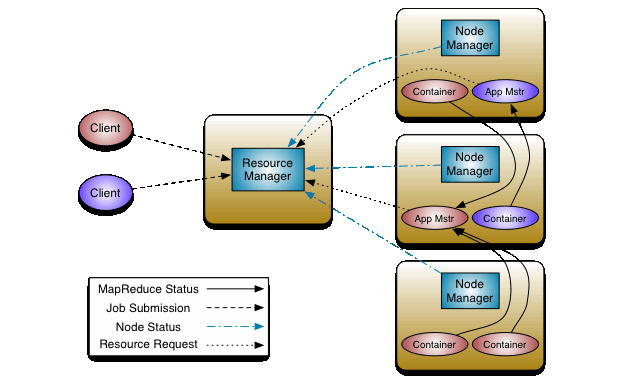
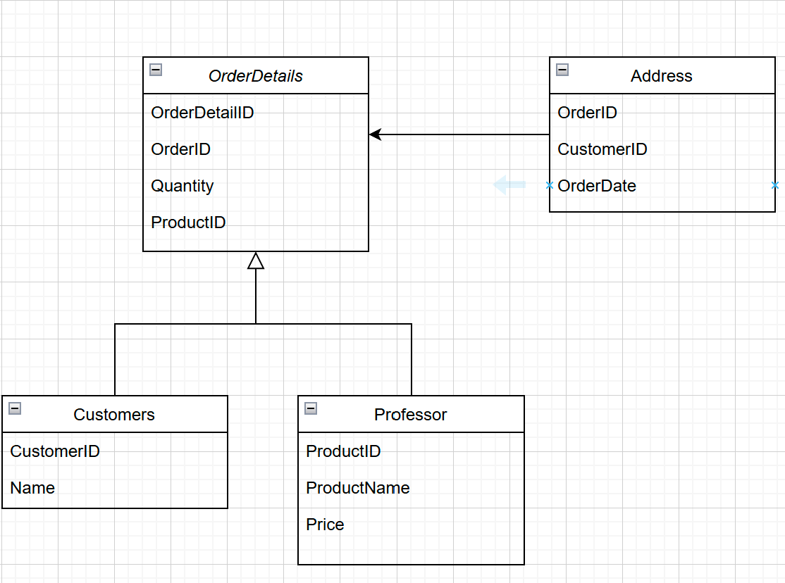
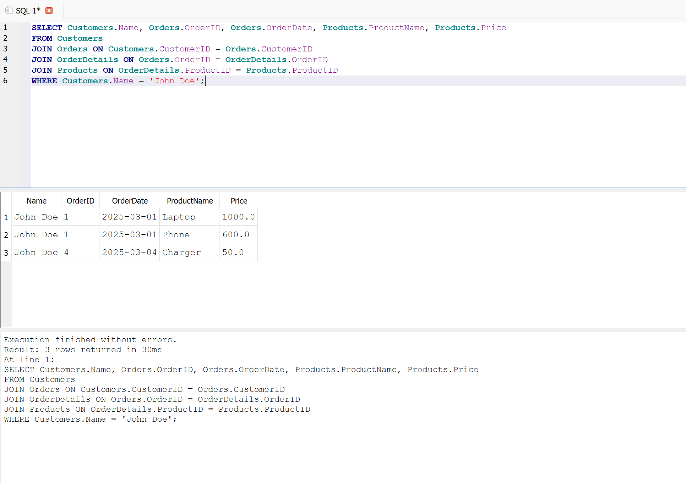
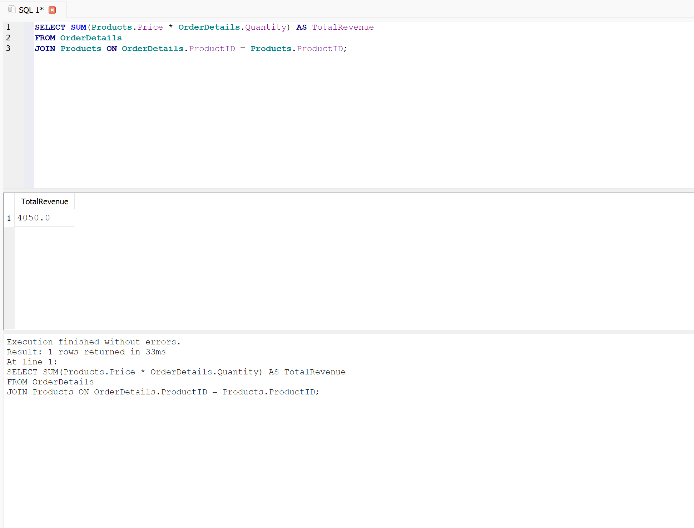
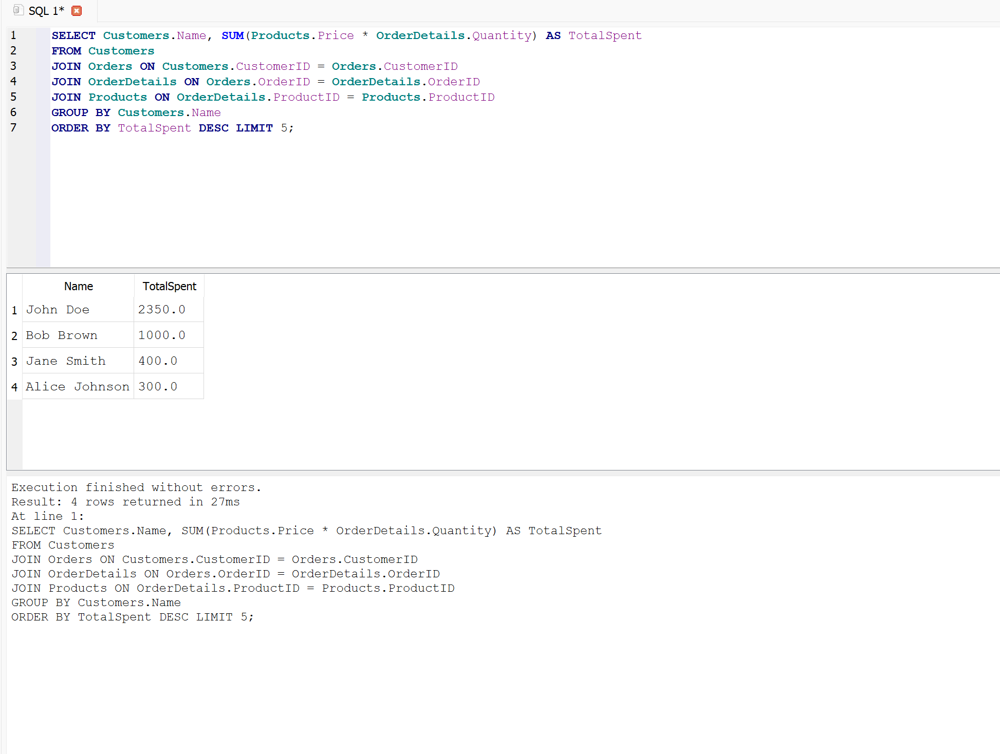

# Task 1: Conceptual Understanding

## **1.1 Big Data Characteristics:**

**Volume, Velocity, and Variety** are factors distinguish big data from traditional data that can be handeled by tradtional systems, Big data requires specialized tools to store, process, and analyze them.

### **Volume**

Volume refers to data with high volume. Traditional databases struggle to store and manage such large datasets, requiring distributed storage solutions like Hadoop.

- **Example**: In telecommunications, radio towers continuously generate call records, signal strength logs, and network traffic data. This large dataset must be stored efficiently for analysis and troubleshooting.

### **Velocity**

Velocity describes the speed at which data is generated and processed. Real-time processing is essential for applications such as fraud detection and network monitoring.

- **Example**: A cellular network continuously receives real-time data on call drops and signal quality. Fast processing allows the system to detect network congestion and adjust frequencies dynamically.

### **Variety**

Variety refers to the different types of data, such as structured , semi-structured, and unstructured. Big Data systems must handle diverse formats efficiently.

- **Example**: A radio system processes multiple data formats, including call logs (structured), radio wave frequencies (semi-structured), and voice recordings (unstructured), requiring adaptable storage and processing techniques.

## **2. Hadoop Ecosystem**

Hadoop is an open-source framework designed for Big Data for reliable, scalable, distributed computing.

### **HDFS (Hadoop Distributed File System)**

HDFS is a distributed storage system that splits large files into smaller blocks and distributes them across multiple nodes.

- **Key Features**:
  - Fault tolerance through data replication
  - Scalability for handling petabytes of data
  - High throughput for efficient processing



### **MapReduce**

MapReduce is a programming model that processes large datasets in parallel by _setup a map_ and _reduce step_, it provides data distribution, replication, and automatic recovery.

<br/>



### **Hadoop YARN**

YARN manages and schedules computational resources across a Hadoop cluster by splitting up the functionalities of resource management and job into separate system services.

- **Key Features**:
  - Supports multiple processing frameworks beyond MapReduce
  - Improves resource utilization and scalability
  - Enhances multi-tenancy for running diverse applications



### **Hadoop in Real-World Data Processing**

#### Netflix's Data Analytics Pipeline

One of real-world uses of Hadoop for processing big data is Netflix's data analysis pipeline.
Netflix is an overseas streaming company that uses Hadoop to process vast amounts of user data, logs, and streaming data in order to improve user experience and optimize content recommendation.

<br>

# Task 2: Hands-On SQL Querying

I'll use dataset gereate by AI tool.



<details>
<summary>Dataset SQL</summary>

```SQL
-- Create Customers Table
CREATE TABLE Customers (
    CustomerID INTEGER PRIMARY KEY AUTOINCREMENT,
    Name TEXT NOT NULL
);

-- Create Products Table
CREATE TABLE Products (
    ProductID INTEGER PRIMARY KEY AUTOINCREMENT,
    ProductName TEXT NOT NULL,
    Price REAL NOT NULL
);

-- Create Orders Table
CREATE TABLE Orders (
    OrderID INTEGER PRIMARY KEY AUTOINCREMENT,
    CustomerID INTEGER NOT NULL,
    OrderDate TEXT NOT NULL,
    FOREIGN KEY (CustomerID) REFERENCES Customers(CustomerID)
);

-- Create OrderDetails Table
CREATE TABLE OrderDetails (
    OrderDetailID INTEGER PRIMARY KEY AUTOINCREMENT,
    OrderID INTEGER NOT NULL,
    ProductID INTEGER NOT NULL,
    Quantity INTEGER NOT NULL,
    FOREIGN KEY (OrderID) REFERENCES Orders(OrderID),
    FOREIGN KEY (ProductID) REFERENCES Products(ProductID)
);

-- Insert Sample Data into Customers
INSERT INTO Customers (Name) VALUES
    ('John Doe'),
    ('Jane Smith'),
    ('Alice Johnson'),
    ('Bob Brown'),
    ('Charlie Davis');

-- Insert Sample Data into Products
INSERT INTO Products (ProductName, Price) VALUES
    ('Laptop', 1000),
    ('Phone', 600),
    ('Tablet', 400),
    ('Headphones', 150),
    ('Charger', 50);

-- Insert Sample Data into Orders
INSERT INTO Orders (CustomerID, OrderDate) VALUES
    (1, '2025-03-01'),
    (2, '2025-03-02'),
    (3, '2025-03-03'),
    (1, '2025-03-04'),
    (4, '2025-03-05');

-- Insert Sample Data into OrderDetails
INSERT INTO OrderDetails (OrderID, ProductID, Quantity) VALUES
    (1, 1, 1),  -- John Doe bought 1 Laptop
    (1, 2, 2),  -- John Doe bought 2 Phones
    (2, 3, 1),  -- Jane Smith bought 1 Tablet
    (3, 4, 2),  -- Alice Johnson bought 2 Headphones
    (4, 5, 3),  -- John Doe bought 3 Chargers
    (5, 1, 1);  -- Bob Brown bought 1 Laptop
```

</details>

### 2.1 Retrieve Customer Purchase History



### 2.1 Aggregating Data



### 3.1 Identifying Top Customers



# Task 3: Data Wrangling in Python

I have used [Titanic dataset](https://www.kaggle.com/datasets/brendan45774/test-file) that has missing values

1. Removing duplicates (if any).

2. Filling missing values:
   Age: Replaced missing values with the median age.
   Fare: Filled missing value with the median fare.
   Cabin: Filled missing values with "Unknown" since most values were missing.

3. aggregated the dataset by grouping it based on Passenger Class (Pclass) and calculating the total fare revenue per class

- Full python code:

```python
import warnings
warnings.simplefilter(action='ignore', category=FutureWarning)

import pandas as pd

file_path = ".\\tested.csv"
df = pd.read_csv(file_path)

# Display dataset info
print("Dataset Information:")
print(df.info())

# Check for missing values
print("\nMissing Values:")
print(df.isnull().sum())

# Show basic statistics
print("\nBasic Statistics:")
print(df.describe())

# Remove duplicate records
df_cleaned = df.drop_duplicates()

# Fill missing values
df_cleaned["Age"].fillna(df_cleaned["Age"].median(), inplace=True)
df_cleaned["Fare"].fillna(df_cleaned["Fare"].median(), inplace=True)
df_cleaned["Cabin"].fillna("Unknown", inplace=True)

# Display cleaned dataset
print("\nCleaned Dataset (First 5 Rows):")
print(df_cleaned.head())

# Data Aggregation: Total Fare per Passenger Class (Pclass)
revenue_per_class = df_cleaned.groupby("Pclass")["Fare"].sum().reset_index()

print("\nTotal Fare per Passenger Class:")
print(revenue_per_class)
```

- Output:

```shell

Dataset Information:
<class 'pandas.core.frame.DataFrame'>
RangeIndex: 418 entries, 0 to 417
Data columns (total 12 columns):
 #   Column       Non-Null Count  Dtype
---  ------       --------------  -----
 0   PassengerId  418 non-null    int64
 1   Survived     418 non-null    int64
 2   Pclass       418 non-null    int64
 3   Name         418 non-null    object
 4   Sex          418 non-null    object
 5   Age          332 non-null    float64
 6   SibSp        418 non-null    int64
 7   Parch        418 non-null    int64
 8   Ticket       418 non-null    object
 9   Fare         417 non-null    float64
 10  Cabin        91 non-null     object
 11  Embarked     418 non-null    object
dtypes: float64(2), int64(5), object(5)
memory usage: 39.3+ KB
None

Missing Values:
PassengerId      0
Survived         0
Pclass           0
Name             0
Sex              0
Age             86
SibSp            0
Parch            0
Ticket           0
Fare             1
Cabin          327
Embarked         0
dtype: int64

Basic Statistics:
       PassengerId    Survived      Pclass         Age       SibSp       Parch        Fare
count   418.000000  418.000000  418.000000  332.000000  418.000000  418.000000  417.000000
mean   1100.500000    0.363636    2.265550   30.272590    0.447368    0.392344   35.627188
std     120.810458    0.481622    0.841838   14.181209    0.896760    0.981429   55.907576
min     892.000000    0.000000    1.000000    0.170000    0.000000    0.000000    0.000000
25%     996.250000    0.000000    1.000000   21.000000    0.000000    0.000000    7.895800
50%    1100.500000    0.000000    3.000000   27.000000    0.000000    0.000000   14.454200
75%    1204.750000    1.000000    3.000000   39.000000    1.000000    0.000000   31.500000
max    1309.000000    1.000000    3.000000   76.000000    8.000000    9.000000  512.329200

Cleaned Dataset (First 5 Rows):
   PassengerId  Survived  Pclass                                          Name     Sex   Age  SibSp  Parch   Ticket     Fare    Cabin Embarked
0          892         0       3                              Kelly, Mr. James    male  34.5      0      0   330911   7.8292  Unknown        Q
1          893         1       3              Wilkes, Mrs. James (Ellen Needs)  female  47.0      1      0   363272   7.0000  Unknown        S
2          894         0       2                     Myles, Mr. Thomas Francis    male  62.0      0      0   240276   9.6875  Unknown        Q
3          895         0       3                              Wirz, Mr. Albert    male  27.0      0      0   315154   8.6625  Unknown        S
4          896         1       3  Hirvonen, Mrs. Alexander (Helga E Lindqvist)  female  22.0      1      1  3101298  12.2875  Unknown        S

Total Fare per Passenger Class:
   Pclass        Fare
0       1  10087.9918
1       2   2064.7957
2       3   2718.2043
```
